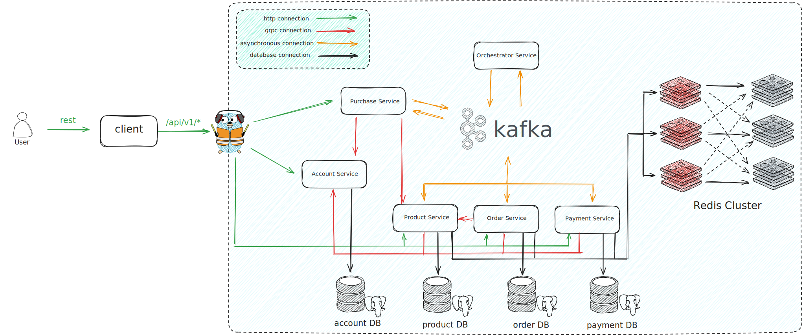

# SAGA ORCHESTRATION

Microservice architecture with Saga Orchestration pattern

## Technical stack:
- Traefik:  edge proxy that is responsible for external traffic routing and internal grpc load-balancing.
- Services: 6 services are implemented in this project.
  - Account service: responsible for managing user accounts, tokens.
  - Product service: responsible for managing products, categories.
  - Order service: responsible for managing orders.
  - Payment service: responsible for managing payments.
  - Purchase service: responsible for managing purchases.
  - Orchestrator service: responsible for managing the saga orchestration.
- Database: 4 databases are used in this project.
  - Account database (PostgreSQL 15): responsible for storing user accounts, tokens.
  - Product database (PostgreSQL 15): responsible for storing products, categories.
  - Order database (PostgreSQL 15): responsible for storing orders.
  - Payment database (PostgreSQL 15): responsible for storing payments.
- Six-node Redis cluster
  - In-memory data store for caching.
  - Cuckoo filter for preventing cache penetration.
  - Distributed lock for preventing cache stampede.
- Kafka:  distributed event streaming platform.
  - Used for SAGA command and event.

## Architecture diagram


## Quick start

Clone this repository:
```sh
git clone https://github.com/scul0405/saga-orchestration.git
cd saga-orchestration
```
#### Docker usage

Run this command:
```sh
make docker-up
```

#### Simple usage
First, we need to signup a new user:
```bash
curl --location 'http://localhost/api/v1/account/auth/register' \
--header 'Content-Type: application/json' \
--data-raw '{
    "email": "deptrai123@gmail.com",
    "password": "deptrai123",
    "first_name": "dep",
    "last_name": "trai",
    "address": "123 street",
    "phone_number": "0123456788"
}'
```
This will return a new token pair (refresh token + access token). We should provide the access token in the `Authorization` header for those APIs with authentication. If your access token is expired. You can login again or get new access token via refresh token.
```bash
curl --location 'http://localhost/api/v1/account/auth/login' \
--header 'Content-Type: application/json' \
--data-raw '{
    "email": "deptrai123@gmail.com",
    "password": "deptrai123"
}'
```

Next, let's create a category to contains some product:
```bash
curl --location 'http://localhost/api/v1/categories' \
--header 'Content-Type: application/json' \
--header 'Authorization: Bearer <access_token>' \
--data '{
    "name" : "whey",
    "description": "whey protein"
}'
```

Go to database and get ID of category recently created to create some products
```bash
curl --location 'http://localhost/api/v1/products' \
--header 'Content-Type: application/json' \
--header 'Authorization: Bearer <access_token>' \
--data '{
    "category_id": <category_id>,
    "name": "Whey Protein Isolate",
    "description": "100% Whey Protein Isolate",
    "brand_name": "OstroVit",
    "price": 1390,
    "inventory": 1000
}'
```
```bash
curl --location 'http://localhost/api/v1/products' \
--header 'Content-Type: application/json' \
--header 'Authorization: Bearer <access_token>' \
--data '{
    "category_id": <category_id>,
    "name": "Whey Protein Professional",
    "description": "100% Whey Protein Professional",
    "brand_name": "Scitec Nutrition",
    "price": 3780,
    "inventory": 1000
}'
```
Here comes the core part. We are going to create a new purchase, which sends a new purchase event to the saga orchestrator and triggers distributed transactions.
```bash
curl --location 'http://localhost/api/v1/purchases' \
--header 'Content-Type: application/json' \
--header 'Authorization: Bearer <access_token>' \
--data '{
    "order_items": [
        {
            "product_id": <first_product_id>,
            "quantity": 4
        },
        {
            "product_id": <second_product_id>,
            "quantity": 5
        }
    ],
    "payment": {
        "currency_code": "VND"
    }
}'
```

## Services
### Account service
No. | API | Method | Authorization required | Description
--- | --- | --- | --- | ---
1 | [/api/v1/account/auth/register](http://localhost/api/v1/account/auth/register) | POST | false | Register account
2 | [/api/v1/account/auth/login](http://localhost/api/v1/account/auth/login) | POST | false | Login account
3 | [/api/v1/account/auth/refresh](http://localhost/api/v1/account/auth/refresh) | POST | false | Refresh access token
4 | [/api/v1/account/customer/personal](http://localhost/api/v1/account/customer/personal) | GET | true | Get personal information
5 | [/api/v1/account/customer/delivery](http://localhost/api/v1/account/customer/delivery) | GET | true | Get delivery information
6 | [/api/v1/account/customer/personal](http://localhost/api/v1/account/customer/personal) | PUT | true | Update personal information
7 | [/api/v1/account/customer/delivery](http://localhost/api/v1/account/customer/delivery) | PUT | true | Update delivery information

### Product service
No. | API | Method | Authorization required | Description
--- | --- | --- | --- | ---
1 | [/api/v1/products/:id](http://localhost/api/v1/products/:id) | GET | false | Get a product with id
2 | [/api/v1/products](http://localhost/api/v1/products) | POST | true | Create a product
3 | [/api/v1/products/:id](http://localhost/api/v1/products) | PUT | true | Update product detail
4 | [/api/v1/categories](http://localhost/api/v1/categories) | POST | true | Create a category

### Order service
No. | API | Method | Authorization required | Description
--- | --- | --- | --- | ---
1 | [/api/v1/orders/:id](http://localhost/api/v1/orders/:id) | GET | true | Get an order with id

### Payment service
No. | API | Method | Authorization required | Description
--- | --- | --- | --- | ---
1 | [/api/v1/payments/:id](http://localhost/api/v1/payments/:id) | GET | true | Get a payment with id

### Purchase service
No. | API | Method | Authorization required | Description
--- | --- | --- | --- | ---
1 | [/api/v1/purchases](http://localhost/api/v1/purchases) | POST | true | Make a purchase

## Monitor

### Kafkdrop
[http://localhost:9000](http://localhost:9000)

### Traefik
[http://localhost:8080](http://localhost:8080)

## TODO
- [ ] API for categories
- [ ] Tracing with OpenTelemetry
- [ ] Observing with Prometheus
- [ ] Server sent event for purchase result 
